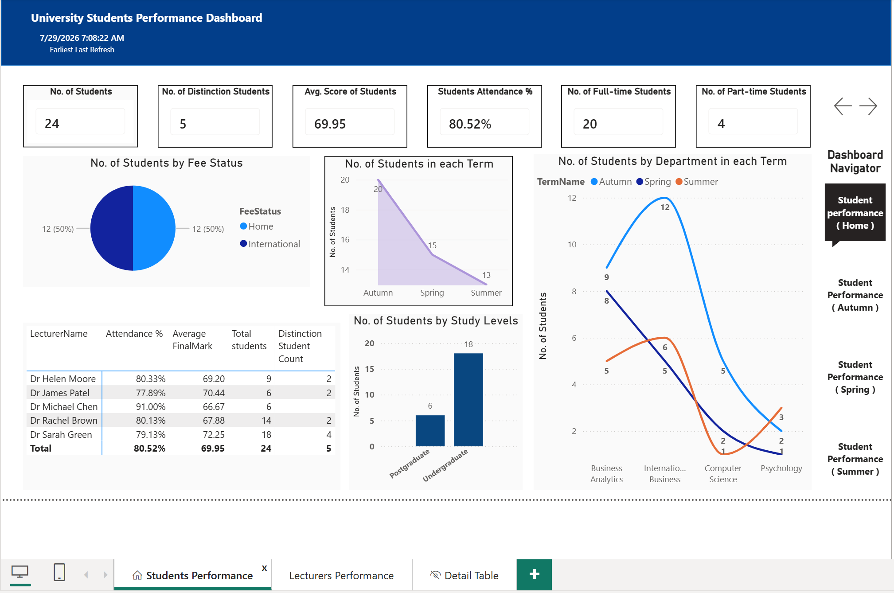

# University Student Performance Dashboard (Power BI)
An interactive Power BI dashboard analyzing university student performance — built on a star schema data model connecting enrolment, course, lecturer, and term data to track academic trends across courses and terms.
## 🔗 Live Interactive Dashboard
[View Walkthrough Video](student_dashboard.gif) <!-- add your video/GIF link here -->
## 📊 Preview
<!-- add a screenshot or GIF of the dashboard here -->

## 💡 Business Questions Answered
| Stakeholder Question | Answer |
|---|---|
| What share of students achieved distinction? | 20.8% of students (5 of 24), concentrated under one lecturer — 4 of Dr. Sarah Green's 18 students earned distinction |
| Does lecturer attendance predict student performance? | No — the highest-attendance lecturer (91%) posted the lowest average final mark (66.67), while the highest-scoring lecturer averaged just 79% attendance |
| How did enrollment change across the academic year? | Enrollment fell 35%, from 20 students in Autumn to 13 in Summer |
| Which department has the most volatile enrollment across terms? | International Business — swinging from 8 students in Autumn to 12 in Spring, then dropping sharply to just 2 in Summer |
| What's the split between full-time and part-time, and home vs. international students? | 20 full-time vs. 4 part-time, and an even 50/50 split between Home and International students |
## 🛠 Tools & Techniques Used
* Power BI Desktop
* Power Query: cleaned and transformed raw data, including pivoting and reshaping tables before loading into the model
* Star schema data modeling: `UniEnrolments` fact table connected to `UniStudents`, `UniLecturers`, `UniCourses`, and `UniTerms` dimension tables
* Relationship modeling: configured one-to-many relationships with single and both cross-filter directions to ensure filters propagate correctly across the model
* DAX: custom measures for performance calculations
* Interactive features: slicers, buttons, bookmarks, and drill-through for report navigation
* Visual polish: icons, images, consistent formatting/alignment, and conditional formatting across visuals
## 📌 Report Breakdown
* **Overview Page:** high-level student performance metrics with slicers for course/term filtering
* **Course Performance:** breakdown of performance trends across courses, using conditional formatting to flag outliers
* **Lecturer/Term Analysis:** drill-through page comparing performance across lecturers and terms
* **Navigation:** bookmark-driven navigation between report states, with buttons for switching views
## 🔧 Skills Demonstrated
* Designing and implementing a star schema from raw relational data
* Managing table relationships (one-to-many, single vs. cross-filter direction)
* Writing DAX measures for performance analysis
* Building interactive navigation with bookmarks, buttons, and drill-through
* Debugging: identifying and resolving data/model errors encountered during development (covered in the walkthrough video)
* Evaluating Power BI vs. Excel (Pivot Tables, Power Query, Power Pivot) for the same analysis task
## 📂 Files
* `.pbix` file included — feel free to download and explore the model, or use it for your own practice
